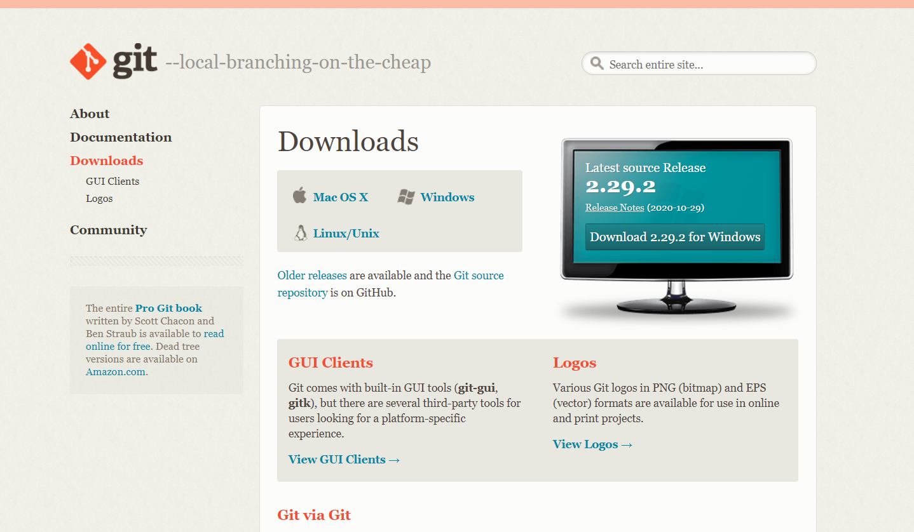

### [**Git**](https://git-scm.com/) 
 Git is a free and open source distributed version control system designed to handle everything from small to very large projects with speed and efficiency.  
 
 [Git Download](https://git-scm.com/downloads) After click on the above link chose the suitable version and install git.  