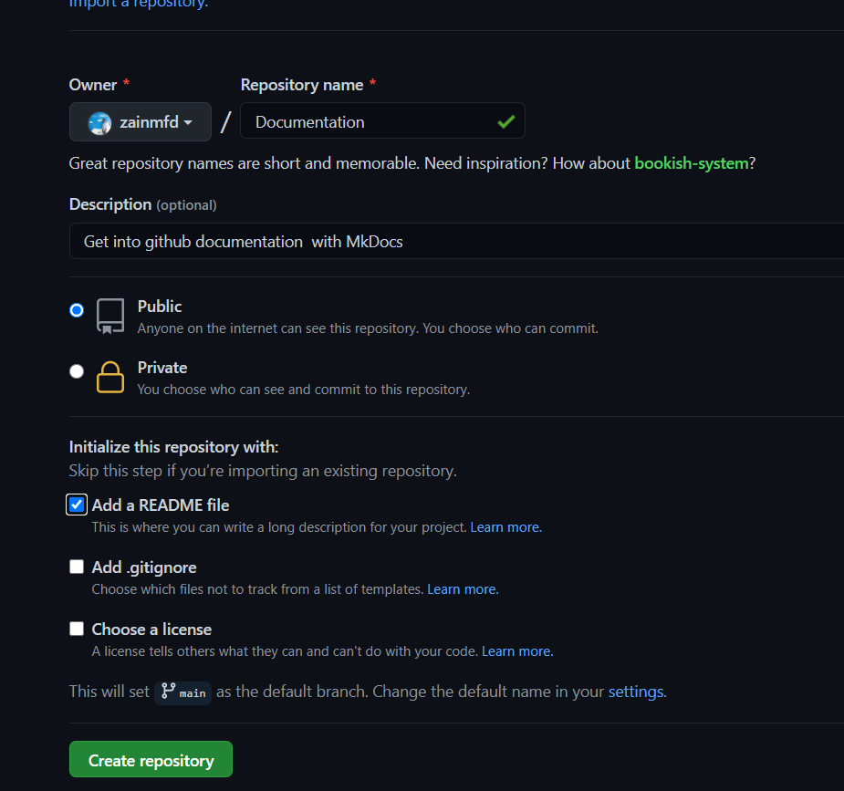

 
 Step 1 :-   
 To add a new repository, We can see a " + " on the right top of the main window of GitHub. Click on that and then click on **New repository**  
   
 Step 2 :-  
 Add a unique name for our repository, then choose whether you want a **private** or **public** repository. Initialize this repository with a **README** and if you need an open-source license choose one. 
   
 At last click on **Create repository**  
 Step 3 :-  
 **Cloning a repository**, When you create a repository on GitHub, it exists as a remote repository. You can clone your repository to create a local copy on your computer and sync between the two locations.  
 You can clone a repository from GitHub to your local computer to make it easier to fix merge conflicts, add or remove files, and push larger commits. When you clone a repository, you copy the repository from GitHub to your local machine.  

Cloning a repository pulls down a full copy of all the repository data that GitHub has at that point in time, including all versions of every file and folder for the project. You can push your changes to the remote repository on GitHub, or pull other people's changes from GitHub.

For cloning right click on where ever you want to get your local copy into your PC and click on **git bash**.  
then enter a comment like shown below.  
```$ git clone https://github.com/username/repository name```
  
**zainmfd** is my user name and **Documentation** is repository name.  
After cloning you can see this window like shown below
  
After this cloning is successfully done. Then you can see a new file(named as your repository name) in that folder.  

Step 4:-  
Open Visual Studio Code then  
Then Install extention by clicking on   
```Extention (Ctrl+Shift+X)```  
Search **Markdoen Preview Enhanced** in *Search Extension in Marketplace*  
   
In my case, I already install Markdown, If you are not installed click on install.  
Markdown is a lightweight and easy-to-use syntax for styling all forms of writing on the GitHub platform.  
Click here for [Markdown syntax](https://guides.github.com/features/mastering-markdown/)  
After that, we want to open our folder to the Visual Studio Code
```File => Open Folder (ctrl + k + o)```  
  
Select the folder that you want to open.

Select your cloned repository, In my case my repository name is **Documentation** and click on **Select Folder**.  
