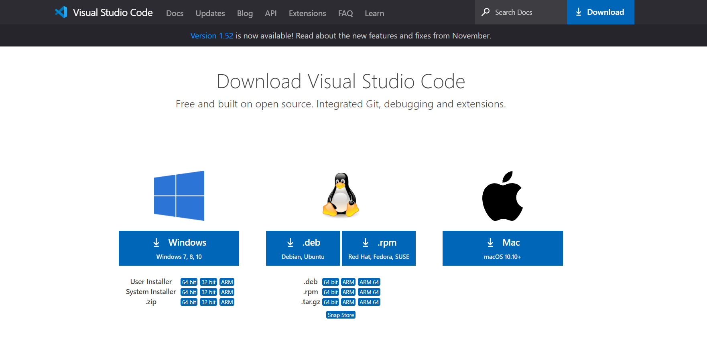

### [**VS-Code**](https://code.visualstudio.com/)  
 Visual Studio Code is a free source-code editor made by Microsoft for Windows, Linux, and macOS. Features include support for debugging, syntax highlighting, intelligent code completion, snippets, code refactoring, and embedded Git. Users can change the theme, keyboard shortcuts, preferences, and install extensions that add additional functionality.
 
 [Visual Studio Code download](https://code.visualstudio.com/download) Choose suitable one.